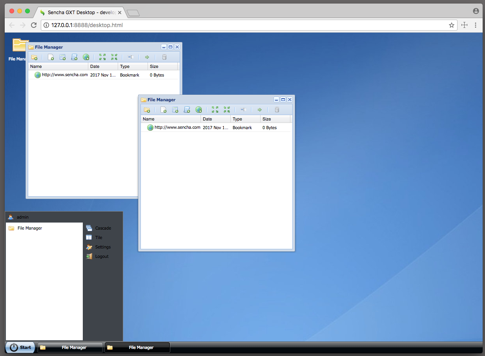

# GXT Demo Desktop
This is an example of the GXT desktop.  

## GXT 

* [Sencha GXT Product Info](https://www.sencha.com/products/gxt/)
* [GXT Guides](http://docs.sencha.com/gxt/4.x/)

## Demo

* [EDash Demo](http://examples.sencha.com/gxt-edash/)

## Import

* Import project.
* If you're using Eclipse you won't have to run mvn install first. 

## Build

* Run `mvn clean install`
